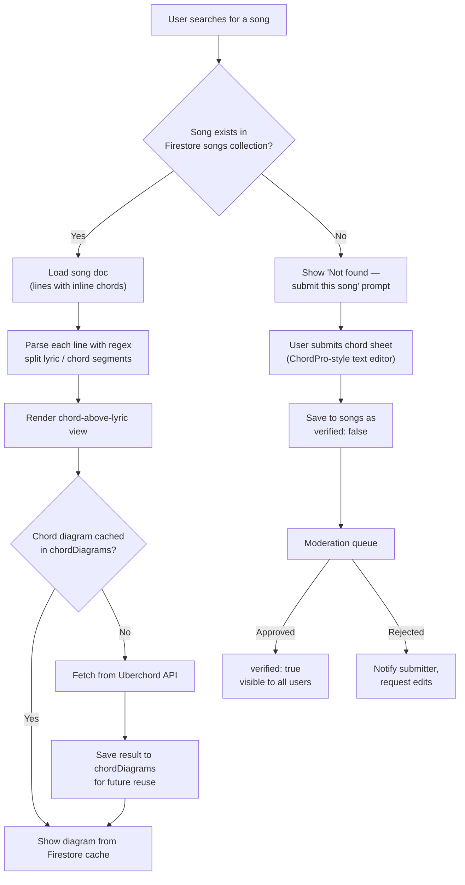
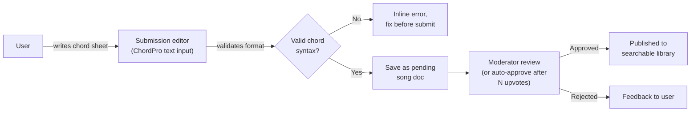

# StringTracker — Chord-to-Lyric Mapping: Design Sketch

How to store, submit, and render songs with chords placed above specific lyrics — built in-house instead of relying on a third-party chord API.

## 1. Data format: ChordPro-style inline markers

Chords are embedded directly in the lyric text, right before the syllable they fall on:

```
[E5]Back in black, [B5]I hit the sack, [A5]I've been too long I'm glad to be [B5]back
```

This single string carries both the lyric and the exact chord timing — no separate offset/position table needed.

## 2. Firestore data model

```
songs (collection)
 └── {songId} (doc)
       title: "Back in Black"
       artist: "AC/DC"
       key: "E"
       capo: 0
       chordsUsed: ["E5", "A5", "B5"]
       verified: true
       submittedBy: "{uid}" | "system"
       lines: [
         "[E5]Back in black, [B5]I hit the sack...",
         "[E5]Yes, I'm [B5]let loose, [A5]from the noose...",
         ...
       ]

chordDiagrams (collection)         // cache of Uberchord lookups
 └── {chordName} (doc)
       strings: "0 2 2 1 0 0"
       fingering: "X 2 3 1 X X"
       tones: "E,A,B"

users/{uid}/submissions (subcollection)
 └── {songId}: { status: "pending" | "approved" | "rejected" }
```

## 3. End-to-end app flow



## 4. Parsing logic (conceptual)

For each line:
1. Run a regex to find every `[ChordName]` marker: `\[([^\]]+)\]`
2. Split the line into alternating segments: `{chord | null, text}`
3. Render each segment as a mini column — chord label on top, lyric text below — laid out in a `Wrap`/`RichText` so the chord sits directly above the syllable it precedes

## 5. Populating content: crowdsourced submission flow



Options for moderation, roughly in order of effort:
- **Manual review** — you or a small team approve submissions (simplest, slowest to scale)
- **Community voting** — auto-publish after N upvotes from other users, flag on downvotes
- **Trusted-submitter tier** — users who've had several approved submissions get auto-publish rights

## 6. Where this fits your existing 5 screens

- **Search** → checks `songs` collection first, falls back to "submit this song"
- **Song detail** (sub-screen) → renders the chord-over-lyric view described above
- **Library** → saved songs, same rendering
- **Profile** → could surface "songs you've submitted" and their approval status as a stat

## 7. Open questions to decide before building

- Do you allow anonymous submissions, or require login? (Login is already required app-wide, so likely just gate submission behind an existing account.)
- Auto-approve threshold, or fully manual moderation to start?
- Should `chordsUsed` diagrams be pre-fetched on song load, or lazy-loaded per chord as the user scrolls?
