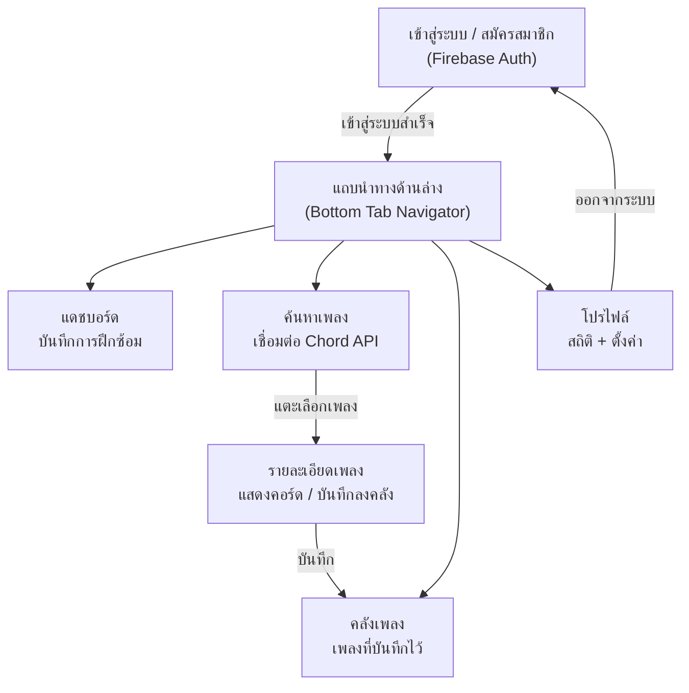
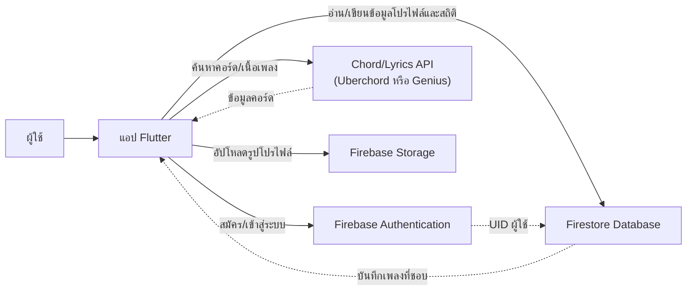

# StringTracker — แอปติดตามการฝึกกีตาร์

แอปโมบายที่ช่วยนักกีตาร์บันทึกการฝึกซ้อม ค้นหาคอร์ดเพลง และติดตามความคืบหน้า พัฒนาด้วย **Flutter** เชื่อมต่อกับ **Firebase** (Auth + Firestore) และ **API ภายนอก** สำหรับข้อมูลคอร์ดเพลง

## เทคโนโลยีที่ใช้

- **Frontend:** Flutter
- **Backend:** Firebase (Authentication, Firestore, Storage)
- **API ภายนอก:** Uberchord API หรือ Genius API (สำหรับข้อมูลคอร์ด/เนื้อเพลง)

## 5 หน้าจอหลัก

1. **เข้าสู่ระบบ / สมัครสมาชิก (Login/Register)** — ยืนยันตัวตนผ่าน Firebase Auth (อีเมล/รหัสผ่าน หรือ Google Sign-in)
2. **โปรไฟล์ (Profile)** — ข้อมูลผู้ใช้ สถิติการฝึกซ้อม ระดับความเชี่ยวชาญ
3. **แดชบอร์ด / บันทึกการฝึกซ้อม (Dashboard)** — บันทึกเวลาฝึกซ้อม สถิติ สตรีค
4. **ค้นหาเพลง/คอร์ด (Search)** — ค้นหาผ่าน API ภายนอก แสดงไดอะแกรมคอร์ด
5. **คลังเพลงที่บันทึกไว้ (Library)** — รายการเพลงที่บันทึก แบ่งตามสถานะ (กำลังเรียนรู้ / เชี่ยวชาญแล้ว)

## โครงสร้างการนำทาง (Navigation Flow)

## การไหลของข้อมูล (Data Flow)

## หมายเหตุ

- หน้า **รายละเอียดเพลง** เป็นหน้าเสริมที่เข้าถึงได้จากหน้าค้นหา (ไม่นับเป็น 1 ใน 5 หน้าหลัก) — สามารถทำเป็นหน้าต่างแบบ modal/bottom sheet แทนได้หากต้องการยึดที่ 5 หน้าจอ
- ใน Flutter แนะนำใช้ `StreamBuilder` ฟัง `FirebaseAuth.authStateChanges()` เพื่อสลับระหว่างหน้า Login กับหน้าหลักอัตโนมัติ
- ใช้ `BottomNavigationBar` ร่วมกับ `IndexedStack` เพื่อรักษาสถานะของแต่ละแท็บ
